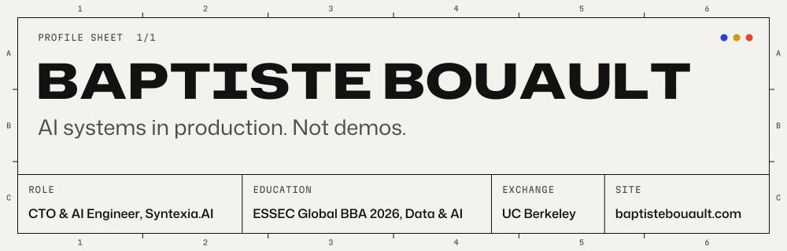

<picture>
  <source media="(prefers-color-scheme: dark)" srcset="assets/header-dark.svg">
  
</picture>

I am CTO and AI Engineer at Syntexia.AI, which builds an AI layer that runs inside business operations.

## In production

- A voice receptionist for a sports club with two sites. It takes and cancels bookings in the club's software and answers 20 to 30 calls a day.
- [baptistebouault.com](https://baptistebouault.com) documents 17 case studies. Five of them are systems in production or in pilot with clients.

## Selected public work

<!-- work:start -->
- **[ede-platform](https://github.com/Baptiste6913/ede-platform)**: Merger arbitrage engine that scores European takeover bids from regulator filings and drives paper trading. Python · last push 2026-10-06
- **[coach-lifestyle](https://github.com/Baptiste6913/coach-lifestyle)**: Next.js and Supabase app that runs a strength program as a live workout screen with per-set logging. TypeScript, PLpgSQL · last push 2026-10-06
- **[Osint-tool](https://github.com/Baptiste6913/Osint-tool)**: Node.js service that finds and scores professional contact details for a named person at a company, from public sources and APIs. JavaScript, HTML · last push 2026-10-06
<!-- work:end -->

## Latest engineering commits

<!-- activity:start -->
- `2026-06-25` [Osint-tool](https://github.com/Baptiste6913/Osint-tool/commit/4ea70fccb2de8d89c240750c64effabd7ae21a5f): v6.0: multi-source resilience, free sources, SMTP/MX validation, RGPD, CRM exports
- `2026-06-03` [ede-platform](https://github.com/Baptiste6913/ede-platform/commit/3056083033e5067cd855cd936bd554eff8077273): feat(phase-14): generate actionable decisions for fresh pool
- `2026-06-03` [ede-platform](https://github.com/Baptiste6913/ede-platform/commit/f00a00a068be8b4ed170aa09c8c506f544ed7860): feat(phase-14): score fresh deal pool with V1 model
- `2026-05-26` [coach-lifestyle](https://github.com/Baptiste6913/coach-lifestyle/commit/2d93bd4baf3ee7526648627bf4ba5b4247e64237): feat(ui): cohérence visuelle Phase 1
- `2026-05-26` [coach-lifestyle](https://github.com/Baptiste6913/coach-lifestyle/commit/0673bedf5ab1243e1dfa1bf53cc7e26a61ee477b): feat(dashboard): nav cards Lancer séance + Saisir 1RM
<!-- activity:end -->

Both sections are rebuilt every day by a GitHub Action in this repository (<a href=".github/workflows/readme.yml">workflow</a>, <a href="scripts/build_readme.py">script</a>).

## Education

ESSEC Global BBA 2026, Data & AI. Exchange at UC Berkeley.

## Contact

[baptistebouault.com](https://baptistebouault.com)
